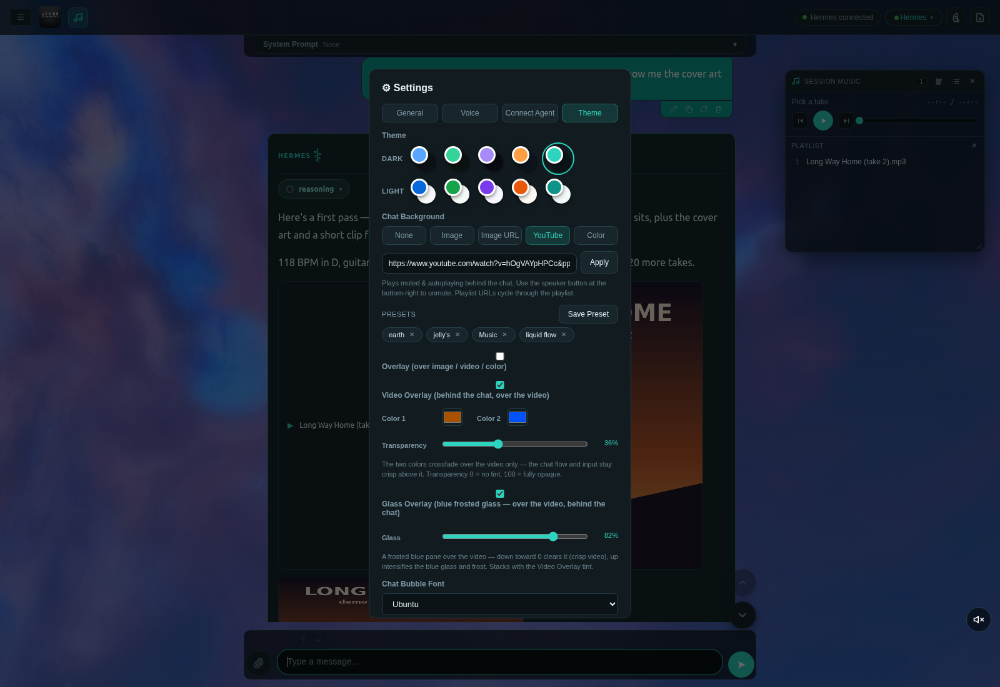
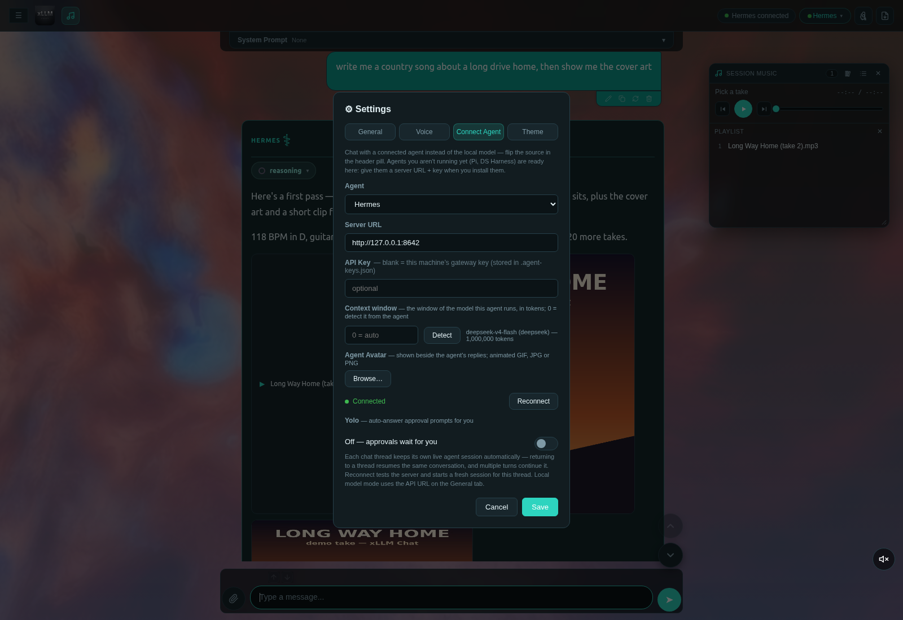
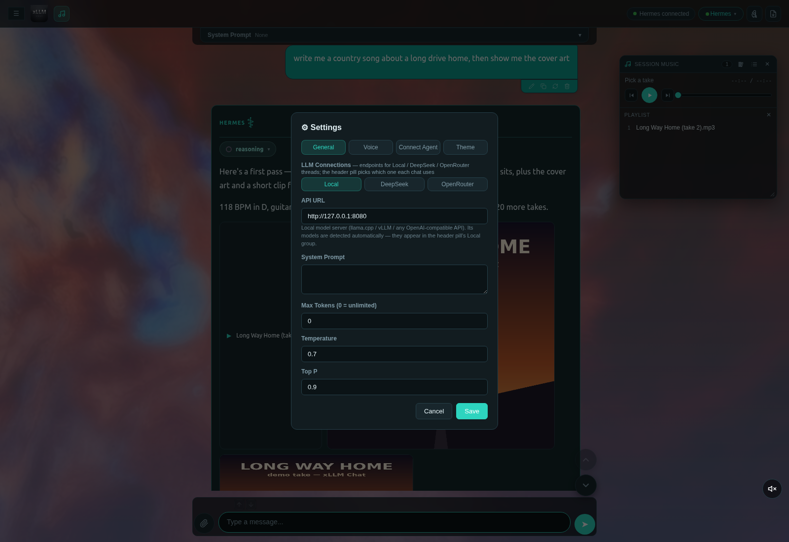
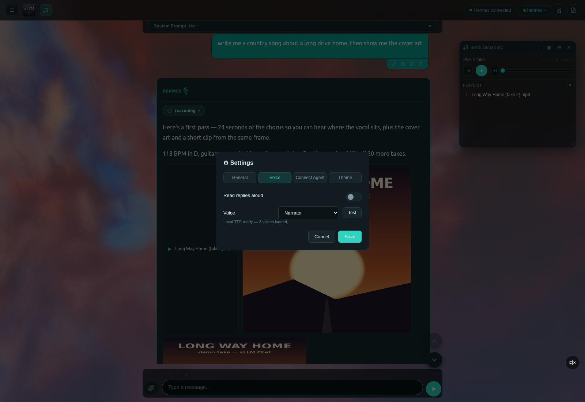
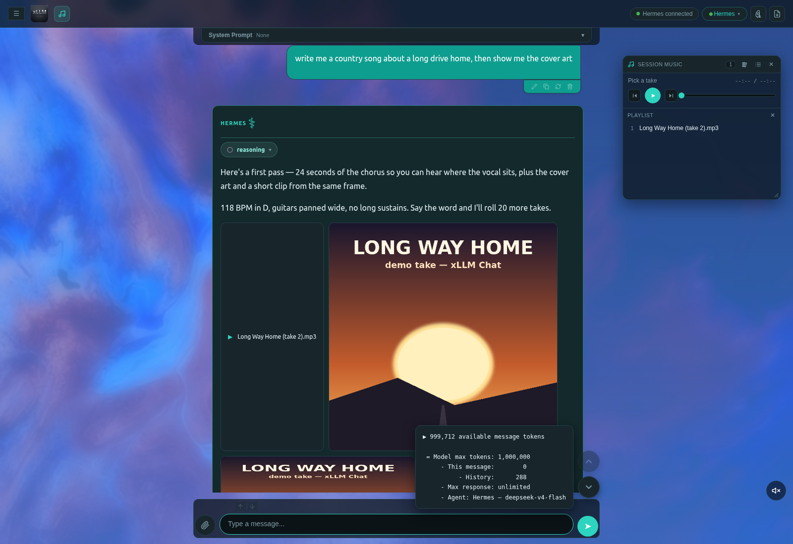
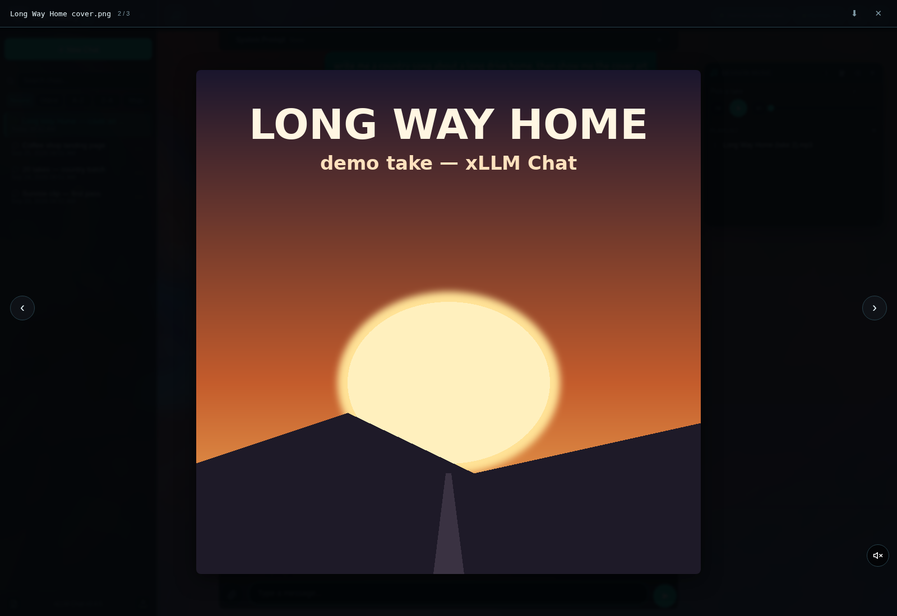
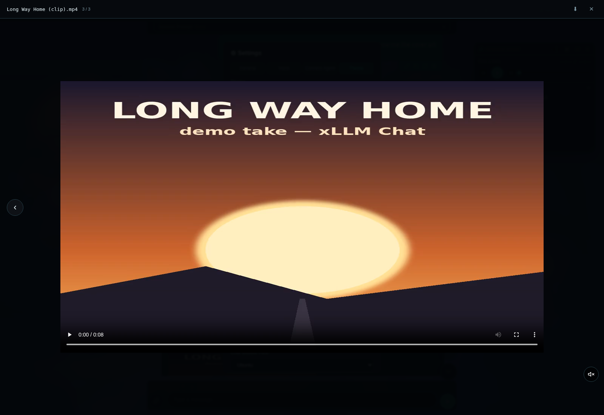
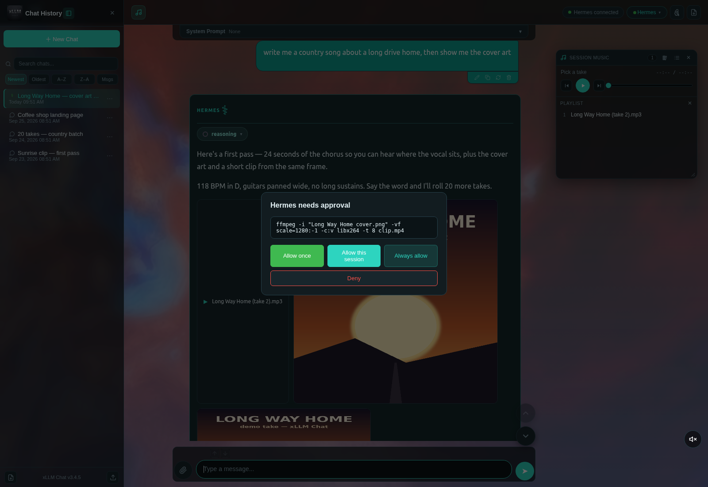
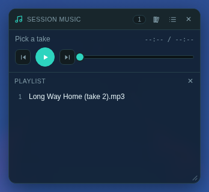

# xLLM Chat


A single-file browser chat window for **local LLMs and connected agents** — llama.cpp, vLLM, or any OpenAI-compatible server, plus live agent sessions with tool-use approvals. One UI that talks to everything. Built to run locally; the front end is a single HTML file with a tiny Python companion server.

## Full functionality — what to put behind it

This window is the front end; how far it goes depends on what you run behind it. Each tier stands alone:

| Tier | What you add | What it unlocks |
|---|---|---|
| **0 — the window** | Python 3, nothing else | the whole UI: themes, backgrounds, presets, attachments, markdown + sandboxed HTML preview, search, export/import, edit & recycle, token bar |
| **1 — a local model** | llama.cpp, vLLM, or any OpenAI-compatible server | streaming chat with exact token/s, thinking pill, unlimited output, per-thread models — all on your machine |
| **2 — cloud** | a DeepSeek or OpenRouter key | frontier models in the same window, same threads, key never in the repo or the page |
| **3 — a capable agent** | **Hermes** (or any runs-capable agent) on loopback | live agent sessions per thread, real tool use, approval prompts (Allow once / this session / always / Deny), Yolo auto-answer, activity feed, measured context |
| **4 — the media factory** | local generators (images/video, music, TTS) + the skills that drive them | generated images and video as inline tiles with a full viewer, a floating session music player with a captured playlist, and replies read aloud by a local voice |

Tier 3 is the hinge — the media tiers are your agent invoking local tools, with xLLM Chat rendering the
result. It never launches or generates anything itself: it shows what your stack produces, on the same
machine, over loopback.

**`AGENTS.md` is the install guide.** It carries the privacy contract this repo is built on (no keys in the
tree, loopback only, same-origin proxying, no absolute paths), the agent contract the UI speaks (the
`/v1/runs` lifecycle, approvals, and the two routes that make the token bar report the agent's real model
and measured context), the media resolution rules and size caps, a copy-paste install checklist, one-command
verifications for every tier, and a symptom → cause table for when something doesn't light up. It is written
to be executed by an AI agent and is just as usable by hand.

## Features

- **Any local model, one window** — the header pill flips the chat source between local models, cloud model providers (DeepSeek / OpenRouter), and connected agents; each chat thread remembers the source (and model) it last used and snaps back to it when you return. Point the API URL at llama.cpp, vLLM, or any OpenAI-compatible server; the client auto-detects the backend and shows the serving model on every response. The client never touches model reasoning settings — reasoning depth is whatever the model launch sets (server flags / template), so every model behaves exactly as launched
- **Cloud model connections** — Settings → LLM Connections configures DeepSeek and OpenRouter (Base URL + API key + one-click Test) alongside the local endpoint; keys stay in your browser only and cloud chats stream through the companion server proxy, so nothing secret ships in this repo. Each provider's models appear in the header pill's Cloud group (OpenRouter also accepts any custom model id)
- **Live agent sessions** — Settings → Connect Agent configures Hermes (the local gateway on `:8642`) or any OpenAI-compatible agent server (Pi, DS Harness, custom). Each chat thread keeps its own live agent session — returning to a thread resumes the same conversation
- **Agent avatar** — Settings → Connect Agent takes a GIF (animated is welcome), JPG or PNG and shows it in the response head, left of the agent's name. It is stored as a Blob in the same IndexedDB store the background slides use — not a base64 data URL — so a multi-megabyte GIF does not inline itself into every agent card, and the heads already on screen repaint the moment you pick one (Remove clears it)
- **Tool-use approvals** — when a connected agent wants to run a tool, xLLM Chat surfaces a native approval prompt (Allow once / Allow this session / Always allow / Deny) with live "agent is working" activity notes; no blind auto-run
- **Yolo switch** — Settings → Connect Agent can auto-answer those approval prompts for you: it clicks the least-permissive allow choice on offer (Allow once → Allow this session → Always allow, never Deny) through the very same button handler a manual click runs, and each auto-answer is logged in the activity notes. A prompt with no allow choice at all is left alone for you to answer
- **Streaming chat** with a live stats bar per response: tokens / time / tok/s (llama.cpp's exact cumulative formula `predicted_n / predicted_ms * 1000`) — a theme-aware plate attached to the response bubble (bottom-rounded, bubble-matched color) so it stays readable over video/image chat backgrounds
- **Thinking pill** — collapsible "reasoning" block for models that emit `delta.reasoning` (pair with vLLM's `--reasoning-parser qwen3` or llama.cpp's reasoning streams)
- **Markdown + code blocks** — GFM via marked.js, syntax highlighting via Prism, Copy / Try-it / Download buttons on code blocks, and a llama.cpp-style sandboxed HTML preview for generated HTML
- **Attachments** — images (sent as OpenAI vision parts), plus txt/csv/json/md/pdf/xlsx/xls/docx (server-side text extraction via `/api/extract`)
- **Unlimited output** — no token cap; truncation is detected and flagged when the server stops at `finish_reason: length`
- **Per-thread system prompts** — each conversation carries its own prompt; new chats inherit the last known one
- **Message actions** — copy, recycle (re-run the prompt), delete (bubble + everything below); jump buttons walk between messages
- **Image zoom in the media viewer** — the wheel zooms the picture about the pointer (1×–8×), so whatever sits under the cursor stays under it while you zoom, and drag pans around while zoomed; zooming back out snaps it home to its centred fit position, and closing the viewer resets it. Images only — video and audio keep their normal wheel behaviour
- **Token context bar** — Big AGI-style segmented bar at the input's bottom edge (history / current message / max response, red on overflow); hover pops the exact context breakdown
- **History** — sidebar with localStorage persistence, thread titles, per-thread source badges, slim theme-aware scrollbars, pin (keeps the panel open while switching chats), ⋯ thread menu (rename / pin / export / delete)
- **JSON export / import** — export one chat or many (bulk export with per-chat checkboxes); imports merge by id
- **Edit messages** — ✎ on user messages: edit an old prompt and re-send; old answers are kept and a ‹ n/N › pill flips between versions
- **Themes** — ten two-color themes, grouped Dark and Light (Blue, Green, Purple, Orange, Teal), on a dedicated **Settings → Theme** tab (theme swatches, chat background, and the bubble font controls all live there): a single click re-themes the whole UI instantly, persisted across reloads
- **Bubble font picker** — Settings → Theme → Chat Bubble Font: choose one of 20 Google Fonts (sans + serif) for user and assistant bubble text — applied instantly, persisted, loaded on demand so only the picked family is fetched; the size slider sits right below it
- **Chat background** — Settings → Theme → Chat Background: a local image, an image URL, a YouTube video or playlist (muted autoplay with a bottom-right unmute), or a color with a transparency slider; optional crossfading overlay; the chat area stays readable while the background shows through. A multi-image **slideshow** mode picks several local images at once (fade / slide / zoom transitions, 2–60 s per slide, persisted in the browser). A ready-made green/black equalizer backdrop ships as `bg-visualizer.png` — point the Image URL field at it (as served, `http://localhost:3001/bg-visualizer.png`) and hit Apply
- **Ships with a starter look, not a blank slate** — a fresh install opens on a moving YouTube visualiser with a two-tone video scrim and glass panels, the warm-ember Teal theme, 16px Ubuntu bubbles, and four saved ambience presets already in the pills (earth, jelly's, Music, liquid flow). It is all just defaults in the settings you already have — change any of it, pick another of the ten themes, or set the background type to None, and your choice is what sticks from then on
- **Prompt presets** — a saved-prompt library sitting in the strip above the message box: `+ Add Preset` (in the corner above the paperclip) saves whatever is in the box under a name you pick, and each preset lands as a clickable pill beside the history arrows (with ✕ to delete). Presets live in their own store, separate from the recall history, and clicking one drops its prompt into the box ready to send
- **Voice read-aloud** — Settings → Voice: reads replies aloud through a local TTS server (Kokoro / Qwen3-TTS cloned voices proxied by the companion server, so no CORS and no cloud)
- **Independent chat threads** — every thread is fully independent: start a long response, flip to any other chat, pick a different source (local / DeepSeek / OpenRouter / agent), and send — other threads' running jobs keep streaming untouched into their own chats; Stop only stops the thread you're looking at. A reload restores each thread's own connection and model
- **Chat search** — live-filters the chat list by title; Enter searches inside the actual messages and lists every matching chat
- **Branded headers** — the xLLM favicon mark (35px) leads the sidebar's Chat History header and replaces the 💬 in the main header
- **Fast-stream rendering** — live response rendering is coalesced (≤10 paints/sec, always latest text) and an open code fence streams as a raw tail instead of re-highlighting the whole block per chunk, so fast models (cloud / local MTP) never freeze the tab or trigger the browser's "not responding" dialog; the block gets its syntax colors the moment it completes

## Run

```bash
python3 chat-server.py        # serves http://localhost:3001
```

Requires Python 3. For attachment extraction of PDF/XLSX/XLS/DOCX, install the extras once:

```bash
pip install --user --break-system-packages pypdf openpyxl xlrd python-docx
```

Open `http://localhost:3001`. The default local API URL is `http://127.0.0.1:8080` (llama.cpp); point it at your vLLM server (`:8000`) or any OpenAI-compatible endpoint in Settings → LLM Connections → Local. To chat with an agent instead, configure one in Settings → Connect Agent (Hermes gateway preset included) and flip the header pill. Agent keys live only in the gitignored `.agent-keys.json` next to the server (or `HERMES_API_KEY`) and cloud keys only in your browser's localStorage — nothing secret ships in this repo. xLLM Chat never launches or kills your model servers.

## Structure

```
index.html        # the whole UI — all CSS/JS inline, marked.js + Prism embedded
chat-server.py    # static file server + /api/extract (attachments), agent/voice/media proxy
launch.sh         # convenience launcher (starts server, opens browser)
favicon-*.png     # icons
```

## A look around

| Settings → Theme | Settings → Connect Agent |
|---|---|
|  |  |
| Settings → General | Settings → Voice |
|  |  |

| The context card | The media viewer |
|---|---|
|  |  |
| Video in the viewer | An approval prompt |
|  |  |

| Session music player |
|---|
|  |

## License

MIT
